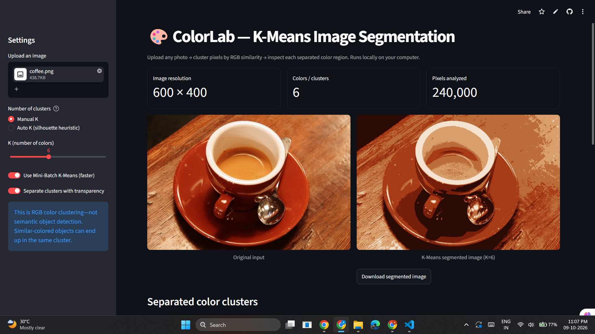

# 🎨 Chroma Cluster — K-Means Image Segmentation

[](https://chromacluster-ai.streamlit.app/)
[](https://github.com/abhijithshetty12/KMeans-Image-Segmentation)
[](https://www.python.org/)
[](https://scikit-learn.org/)
[](https://numpy.org/)
[](https://streamlit.io/)
[](https://pillow.readthedocs.io/)

**[Chroma Cluster](https://chromacluster-ai.streamlit.app/)** is an interactive, unsupervised machine learning application that segments uploaded images into groups of similar colors using **K-Means clustering**.

Built with **Python, Scikit-learn, NumPy, Pillow, and Streamlit**, the application transforms RGB pixel values into color clusters, reconstructs a simplified version of the original image, and allows users to inspect and download each separated color region. It also supports manual cluster selection and an optional silhouette-score-based suggestion for the number of clusters.

The project was developed as a practical demonstration of **Unsupervised Learning — K-Means Clustering** for a Machine Learning Innovative Examination.

---

## 🚀 Key Features

- **🖼️ Image Upload:** Accepts JPG, JPEG, PNG, and WebP images.
- **🎯 K-Means Color Segmentation:** Groups pixels by similarity in RGB color space.
- **🎛️ Manual Cluster Selection:** Choose the number of clusters, **K = 2–12**.
- **🧠 Automatic K Suggestion:** Uses sampled silhouette scores to suggest a cluster count (typically K = 2–8).
- **⚡ Mini-Batch K-Means:** Optional faster clustering for larger images.
- **🔀 Before-and-After Comparison:** View the original and K-color segmented images side by side.
- **🎨 Individual Color Groups:** Isolate each cluster as a transparent PNG while retaining the corresponding original pixels (or using the centroid color).
- **📊 Cluster Distribution:** Explore the proportion of image pixels assigned to each cluster.
- **⬇️ Exports:** Download the segmented image, individual cluster PNGs, or all outputs as a ZIP archive.
- **💻 Interactive Web Interface:** Run locally or host on Streamlit Community Cloud.

---

## 🧠 How K-Means Image Segmentation Works

Each pixel is represented as a three-dimensional RGB vector:

\[
P_i = [R_i, G_i, B_i]
\]

K-Means partitions the pixels into **K color clusters** by repeatedly assigning pixels to their nearest centroid and updating each centroid as the mean of its assigned pixels. It aims to minimize within-cluster squared Euclidean distances:

\[
J = \sum_{k=1}^{K} \sum_{x_i \in C_k} \|x_i - \mu_k\|^2
\]

Once clustering is complete, each pixel is replaced with its assigned cluster's centroid color to form the segmented image. The application can also isolate the original pixels belonging to each cluster.

> **Important:** These clusters represent **similar colors, not recognized objects**. Parts of different objects can belong to the same cluster when their colors are similar.

---

## 🔄 Machine Learning Workflow

```text
Upload Image (JPG / PNG / WebP)
              ↓
Read, Rotate & Resize Image
              ↓
Convert to RGB Pixel Array
              ↓
Choose K Manually ── or ── Suggest K Using Silhouette Scores
              ↓
Fit K-Means / Mini-Batch K-Means
              ↓
Assign Every Pixel to a Cluster
              ↓
Compute Centroid Colors & Cluster Proportions
              ↓
Reconstruct Segmented Image
              ↓
Generate Separated Transparent Color Layers
              ↓
View Results & Download PNG / ZIP
```

---

## ⚙️ Clustering Settings

| Setting | Options | Purpose |
| :--- | :--- | :--- |
| **Cluster Mode** | Manual K / Auto K | Manual control or data-driven suggestion |
| **Manual K** | 2–12 | Set the number of output color groups |
| **Auto K** | Sampled silhouette-score heuristic | Suggest a value of K based on pixel-color separation |
| **Algorithm** | K-Means / Mini-Batch K-Means | Choose between standard clustering and a faster approximation |
| **Cluster Isolation** | Original pixels / Centroid color | Control how isolated cluster layers appear |

### Manual K vs. Automatic K

- **Manual K:** Useful for experimenting with how a smaller or larger color palette changes the image.
- **Automatic K:** Tests candidate K values on sampled pixels and selects the candidate with the highest sampled silhouette score. This is a **heuristic**, not a guarantee of the visually best segmentation.

| K Value | Typical Visual Effect |
| :---: | :--- |
| **K = 2** | Strong simplification into two dominant colors |
| **K = 4** | Retains several major color regions |
| **K = 6** | Balances color simplification and detail in many images |
| **K = 10–12** | Preserves more color shades and gradients |

These are illustrative tendencies; actual output depends on the uploaded image.

---

## 🖼️ Test Images & Expected Observations

Try the app with photographs and synthetic color charts:

| Test Image | Suggested K | What to Observe |
| :--- | :--- | :--- |
| **Six solid color blocks** | 6 | Separation of clearly distinct colors |
| **Color wheel** | 4, 8, 12 | How gradients are quantized into color groups |
| **Cat photograph** | 3, 5, 8 | How fur and background colors can overlap |
| **Astronaut photograph** | 4, 8, 12 | Preservation of clothing and facial color detail |
| **Architecture** | 2, 4, 8 | Differences in sky, walls, windows, and shadows |
| **Colorful bird** | 5, 10, 12 | How more clusters preserve feather color variation |

No fixed accuracy or performance values are claimed here; outputs depend on the chosen image and settings.

---

## 🛠 Tech Stack

| Category | Tools |
| :--- | :--- |
| **Programming Language** | Python 3.11 |
| **Machine Learning** | Scikit-learn (K-Means, MiniBatchKMeans) |
| **Automatic K Evaluation** | Scikit-learn Silhouette Score |
| **Array Processing** | NumPy |
| **Image Processing** | Pillow (PIL) |
| **Web Interface** | Streamlit |
| **Export Formats** | PNG, ZIP |
| **Development** | VS Code |
| **Hosting** | Streamlit Community Cloud |

---

## 📁 Project Structure

```text
KMeans-Image-Segmentation/
│
├── app.py                  # Streamlit app and ML pipeline
├── requirements.txt        # Python dependencies
├── README.md               # Project documentation
├── screenshots/
│   └── dashboard.png        # App screenshot for README preview
├── KMeans_Test_Images/      # Optional local sample images
│
└── .gitignore              # Excludes .venv, __pycache__, local files
```

The `KMeans_Test_Images` directory is optional and is not needed for deployment. Virtual environments and cache files should not be committed.

---

## 🖼️ Interface Preview

### Main Dashboard

<p align="center">
  
</p>

> The screenshot must be committed at `screenshots/dashboard.png` in the GitHub repository for this preview to appear.

---

## ⚙️ Installation

Clone the GitHub repository:

```bash
git clone https://github.com/abhijithshetty12/KMeans-Image-Segmentation.git
cd KMeans-Image-Segmentation
```

Or open the existing project folder in VS Code.

Create a virtual environment:

```bash
python -m venv .venv
```

Activate it on Windows PowerShell:

```powershell
.\.venv\Scripts\Activate.ps1
```

Install dependencies:

```bash
python -m pip install -r requirements.txt
```

If PowerShell blocks activation, run `Set-ExecutionPolicy -Scope Process -ExecutionPolicy Bypass` and retry. You can also call `.venv\Scripts\python.exe` directly without activating.

---

## ▶️ Run the Application

From the project root:

```bash
python -m streamlit run app.py
```

Open the local application at:

```text
http://localhost:8501
```

To stop the app, press **Ctrl + C** in the terminal.

---

## ☁️ Deployment

1. Push `app.py`, `requirements.txt`, `README.md`, and your screenshot to the [GitHub repository](https://github.com/abhijithshetty12/KMeans-Image-Segmentation).
2. Visit [Streamlit Community Cloud](https://share.streamlit.io/).
3. Select `abhijithshetty12/KMeans-Image-Segmentation` as the repository.
4. Select the `main` branch and use `app.py` as the entry point.
5. Choose Python 3.11 and deploy.
6. Visit the deployed app: **[chromacluster-ai.streamlit.app](https://chromacluster-ai.streamlit.app/)**.

> The application processes uploaded images during each user session. Avoid uploading sensitive images to an online deployment unless you understand the hosting provider's privacy and data-handling terms.

---

## 🎯 Project Objective

The aim of **Chroma Cluster** is to demonstrate how unsupervised learning can organize image pixels into meaningful **color-based groups** without requiring labeled training data.

The interactive interface helps learners understand the role of the cluster count **K**, the effect of centroid-based grouping, and the trade-off between a simplified color palette and preservation of visual detail.

---

## 📚 Research Context

This project relates to the Machine Learning Module 4 topic **Distance-Based Clustering — K-Means** and was developed for an Innovative Examination involving a review of recent research papers and a practical implementation.

One paper discussed in the project is:

**Sabha, M., Mousa, A., & Maree, M. (2026).** *Automatic determination of number of clusters in K-means for colored image segmentation using PCA eigen vectors and weighted color channel variance.* Scientific Reports. [https://doi.org/10.1038/s41598-026-65052-z](https://doi.org/10.1038/s41598-026-65052-z)

**Implementation clarification:** This application implements **standard RGB K-Means** and a **silhouette-based automatic K heuristic**. It does **not** currently reproduce that research paper's PCA/weighted-variance method. A faithful research-paper reproduction would require implementing and evaluating the paper's proposed algorithm separately.

---

## ⚠️ Limitations

- **Color-based, not semantic segmentation:** The app groups RGB colors rather than recognizing objects or scene categories.
- **Sensitivity to K:** Too few clusters may remove details; too many may preserve noise or unnecessary variations.
- **Sensitivity to initialization:** K-Means can converge to different local solutions depending on initial centers (the app uses a fixed random seed for repeatability).
- **Image resizing:** Uploaded images are reduced to fit within **900 × 900 pixels** for interactive performance.
- **Sample-based training:** Fitting may use a maximum of **100,000 sampled pixels**, followed by prediction for the displayed image pixels.
- **Automatic K is approximate:** The silhouette-based heuristic depends on sampled pixels and does not optimize human-perceived image quality directly.
- **No object boundaries or ground-truth masks:** The app does not calculate segmentation accuracy against manually annotated object regions.

---

## 🔮 Future Scope

- Implement PCA- and color-variance-based automatic K selection from the selected research paper.
- Compare automatic K strategies using common images and evaluation metrics.
- Add alternative color spaces such as HSV and CIELAB.
- Compare K-Means with K-Medoids, DBSCAN, and Gaussian Mixture Models.
- Include image-quality metrics such as PSNR and SSIM where appropriate.
- Introduce spatial pixel coordinates to reduce scattered clusters of similar colors.
- Add side-by-side comparison of multiple K values in a single run.
- Expand benchmarking across more diverse image datasets.

---

## 👨‍💻 Author

**Abhijith Shetty**  
*AI & Machine Learning Student | Developer*

> "Building intelligent systems that transform data into meaningful and practical insights."

[](https://linkedin.com/in/abhijithshetty12)
[](https://github.com/abhijithshetty12)

---

## 🌟 Show Your Support

If you find **Chroma Cluster** useful for learning image segmentation or K-Means clustering, consider leaving a ⭐ on GitHub.
